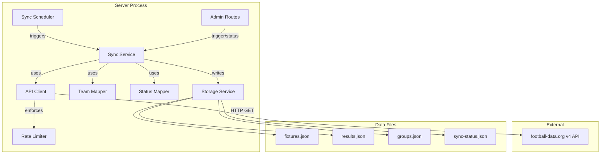

# Design Document: Football Data Sync

## Overview

This feature introduces an automated data synchronisation layer between the football-data.org v4 REST API and the application's local JSON data files. The system polls the external API on a configurable schedule (default: hourly), transforms the response data to match internal formats, and writes updates to `fixtures.json`, `results.json`, and `groups.json` atomically.

The design prioritises resilience — API failures, rate limits, and malformed responses must never corrupt existing local data. Manual admin entry via the existing admin panel remains fully functional as a fallback.

### Key Design Decisions

1. **No new database** — continues using JSON file storage with the existing `storageService.js` locking mechanism, extended with atomic writes (temp file + rename).
2. **In-process scheduler** — uses `setInterval`/`setTimeout` within the Node.js server process rather than an external cron job, keeping deployment simple.
3. **Static team mapping** — a hardcoded constant maps football-data.org numeric IDs to internal three-letter codes, validated at startup.
4. **Sliding window rate limiter** — tracks request timestamps in memory to stay within the free-tier limit (9 req/60s with 1 headroom).

## Architecture



### Component Responsibilities

| Component | Responsibility |
|-----------|---------------|
| **Sync Scheduler** | Manages timing of sync executions, prevents overlapping runs, handles graceful shutdown |
| **Sync Service** | Orchestrates a sync cycle: fetch → transform → validate → write |
| **API Client** | HTTP communication with football-data.org, handles auth headers, timeouts, retries |
| **Rate Limiter** | Sliding window tracker ensuring ≤9 requests per 60-second window |
| **Team Mapper** | Static lookup from football-data.org numeric team IDs → internal 3-letter codes |
| **Status Mapper** | Maps API match status enums to application fixture status strings |
| **Storage Service** | Existing file I/O with locking, extended with atomic write support |

## Components and Interfaces

### API Client (`server/services/sync/apiClient.js`)

```javascript
/**
 * @param {string} endpoint - API path (e.g., '/v4/competitions/WC/matches')
 * @param {object} [params] - Query parameters
 * @returns {Promise<object>} Parsed JSON response
 * @throws {ApiError} On HTTP errors, timeouts, or rate limit exhaustion
 */
export async function fetchFromApi(endpoint, params = {})

/**
 * @typedef {Object} ApiError
 * @property {number} status - HTTP status code (0 for network errors)
 * @property {string} message - Human-readable error description
 * @property {boolean} retryable - Whether the error is worth retrying
 */
```

Configuration:
- Base URL: `https://api.football-data.org`
- Auth header: `X-Auth-Token: <FOOTBALL_DATA_API_KEY>`
- Request timeout: 30 seconds
- Retry on timeout: up to 2 additional attempts, 5-second delay between
- Retry on 429: up to 3 attempts, 60-second delay between
- No retry on 403 (auth failure)

### Rate Limiter (`server/services/sync/rateLimiter.js`)

```javascript
/**
 * Waits until a request can be made within the rate limit window.
 * @returns {Promise<void>} Resolves when the request can proceed
 * @throws {Error} If max delay (65s) would be exceeded
 */
export async function acquireSlot()

/**
 * Records that a request was made at the current timestamp.
 */
export function recordRequest()

/**
 * Resets the rate limiter state (for testing).
 */
export function reset()
```

Implementation: maintains an array of timestamps. On `acquireSlot()`, removes entries older than 60 seconds, checks if count < 9. If not, calculates delay until oldest entry expires, waits (up to 65s max).

### Team Mapper (`server/services/sync/teamMapper.js`)

```javascript
/**
 * Maps a football-data.org numeric team ID to internal 3-letter code.
 * @param {number} apiTeamId - The football-data.org team ID
 * @returns {string|null} Three-letter code or null if unmapped
 */
export function mapTeamId(apiTeamId)

/**
 * Validates that all teams in teams.json have a mapping entry.
 * @param {Array<string>} internalTeamIds - All team IDs from teams.json
 * @returns {{ valid: boolean, unmapped: string[] }}
 */
export function validateMapping(internalTeamIds)

/** @type {Map<number, string>} */
export const TEAM_ID_MAP // e.g., { 760: 'esp', 762: 'arg', ... }
```

### Status Mapper (`server/services/sync/statusMapper.js`)

```javascript
/**
 * Maps a football-data.org match status to internal fixture status.
 * @param {string} apiStatus - API status enum value
 * @returns {{ status: string|null, known: boolean }}
 *   status: mapped value or null if unknown
 *   known: whether the input was a recognised status
 */
export function mapMatchStatus(apiStatus)
```

Mapping table:
| API Status | App Status |
|-----------|------------|
| SCHEDULED, TIMED | "scheduled" |
| FINISHED | "completed" |
| LIVE, IN_PLAY, PAUSED | "in_progress" |
| POSTPONED, SUSPENDED, CANCELLED | "postponed" |
| Other | null (unknown) |

### Sync Service (`server/services/sync/syncService.js`)

```javascript
/**
 * Executes a full sync cycle: fixtures → results → standings.
 * @returns {Promise<SyncResult>}
 */
export async function executeSyncCycle()

/**
 * @typedef {Object} SyncResult
 * @property {'success'|'failure'} outcome
 * @property {string} timestamp - ISO 8601 UTC
 * @property {string|null} error - Error details on failure
 * @property {{ fixtures: number, results: number, standings: boolean }} stats
 */
```

Sync cycle steps:
1. Fetch matches from `/v4/competitions/WC/matches`
2. For each match: map teams, map status, merge into fixtures
3. For each FINISHED match: create/update result entry
4. If group stage still active: fetch standings, reorder groups
5. Write all modified files atomically
6. Write sync-status.json
7. Trigger `checkTournamentComplete()` if new results added

### Sync Scheduler (`server/services/sync/syncScheduler.js`)

```javascript
/**
 * Starts the sync scheduler.
 * @param {object} options
 * @param {number} [options.intervalMs=3600000] - Interval between syncs
 * @param {number} [options.initialDelayMs=5000] - Delay before first sync
 */
export function startScheduler(options = {})

/**
 * Stops the scheduler and waits for any in-progress sync to complete.
 * @returns {Promise<void>}
 */
export async function stopScheduler()

/**
 * Returns whether a sync is currently in progress.
 * @returns {boolean}
 */
export function isSyncInProgress()

/**
 * Triggers an immediate sync (for admin endpoint).
 * @returns {Promise<SyncResult>}
 * @throws {Error} If sync already in progress
 */
export async function triggerManualSync()
```

### Admin Sync Routes (`server/routes/adminRoutes.js` — extended)

```javascript
// GET /api/admin/sync/status → latest sync-status.json entry
// POST /api/admin/sync/trigger → triggers immediate sync
```

Both endpoints are protected by the existing `adminAuth` middleware.

## Data Models

### Sync Status (`server/data/sync-status.json`)

```json
{
  "lastSync": {
    "timestamp": "2025-06-28T12:00:00.000Z",
    "outcome": "success",
    "error": null,
    "stats": {
      "fixturesUpdated": 3,
      "resultsCreated": 2,
      "standingsUpdated": true
    }
  },
  "lastManualTrigger": "2025-06-28T11:30:00.000Z"
}
```

### Team ID Mapping (static constant)

```javascript
// Map<number, string> — football-data.org team ID → internal code
export const TEAM_ID_MAP = new Map([
  [760, 'esp'],  // Spain
  [762, 'arg'],  // Argentina
  [773, 'fra'],  // France
  [66, 'eng'],   // England
  [764, 'bra'],  // Brazil
  [765, 'por'],  // Portugal
  [8601, 'ned'], // Netherlands
  [805, 'bel'],  // Belgium
  [759, 'ger'],  // Germany
  [7850, 'usa'], // United States
  [7890, 'mex'], // Mexico
  [7886, 'can'], // Canada
  // ... all 48 teams
]);
```

### Extended Fixture Schema

Fixtures gain an optional `apiMatchId` field to enable matching:

```json
{
  "id": "f075",
  "apiMatchId": 467890,
  "homeTeam": "bra",
  "awayTeam": "civ",
  "date": "2026-05-24T21:30:00Z",
  "stage": "Round of 32",
  "status": "scheduled"
}
```

### API Response Shapes (football-data.org v4)

**Matches endpoint** (`/v4/competitions/WC/matches`):
```json
{
  "matches": [
    {
      "id": 467890,
      "utcDate": "2026-05-24T21:30:00Z",
      "status": "SCHEDULED",
      "stage": "GROUP_STAGE",
      "group": "GROUP_A",
      "homeTeam": { "id": 760, "name": "Spain", "tla": "ESP" },
      "awayTeam": { "id": 762, "name": "Argentina", "tla": "ARG" },
      "score": {
        "winner": null,
        "duration": "REGULAR",
        "fullTime": { "home": null, "away": null },
        "halfTime": { "home": null, "away": null }
      }
    }
  ]
}
```

**Standings endpoint** (`/v4/competitions/WC/standings`):
```json
{
  "standings": [
    {
      "stage": "GROUP_STAGE",
      "type": "TOTAL",
      "group": "GROUP_A",
      "table": [
        { "position": 1, "team": { "id": 760, "name": "Spain" }, "points": 9 },
        { "position": 2, "team": { "id": 762, "name": "Argentina" }, "points": 6 }
      ]
    }
  ]
}
```

## Correctness Properties

*A property is a characteristic or behavior that should hold true across all valid executions of a system — essentially, a formal statement about what the system should do. Properties serve as the bridge between human-readable specifications and machine-verifiable correctness guarantees.*

### Property 1: API key header inclusion

*For any* request made by the API Client to football-data.org, the request SHALL include an `X-Auth-Token` header with the configured API key value.

**Validates: Requirements 1.3**

### Property 2: Sync interval validation

*For any* integer value provided as `SYNC_INTERVAL_MS`, the Sync Scheduler SHALL accept it as the interval if and only if it is between 60000 and 86400000 inclusive; all other values (non-integers, out-of-range) SHALL cause fallback to the default 3600000ms interval.

**Validates: Requirements 2.3, 2.4**

### Property 3: Fixture sync merge correctness

*For any* set of API match responses and any existing fixtures array, the sync merge operation SHALL: (a) update existing fixtures matched by `apiMatchId` with the latest date and status, (b) create new fixture entries for unmatched API matches with valid team mappings, and (c) never remove or modify fixtures that have no corresponding API match in the response.

**Validates: Requirements 3.2, 3.5, 4.1**

### Property 4: Team mapper bijectivity

*For any* football-data.org team ID present in the TEAM_ID_MAP, the mapper SHALL return a unique three-letter code that exists in the application's teams.json, and no two API team IDs SHALL map to the same internal code.

**Validates: Requirements 3.3, 9.1**

### Property 5: Status mapping totality over known statuses

*For any* API match status in the set {SCHEDULED, TIMED, FINISHED, LIVE, IN_PLAY, PAUSED, POSTPONED, SUSPENDED, CANCELLED}, the status mapper SHALL return a non-null application status string from the set {"scheduled", "completed", "in_progress", "postponed"}.

**Validates: Requirements 3.6, 10.1**

### Property 6: Result data integrity

*For any* result entry created or updated by the sync service from a FINISHED API match, the entry SHALL have: (a) `homeScore` and `awayScore` as integers in [0, 99], (b) a `fixtureId` that references an existing fixture in fixtures.json with status "completed", and (c) if `penaltyShootout` is present, then `homeScore === awayScore` and `penaltyShootout.winner` is one of `homeTeam` or `awayTeam` with non-negative integer `homeGoals` and `awayGoals`.

**Validates: Requirements 4.2, 4.3, 4.4**

### Property 7: Result sync idempotence

*For any* FINISHED API match, syncing it multiple times SHALL produce exactly one result entry in results.json for the corresponding fixtureId — subsequent syncs update the existing entry rather than creating duplicates.

**Validates: Requirements 4.5**

### Property 8: Group standings reordering preserves membership

*For any* valid standings API response, after the sync updates groups.json: (a) the set of group names remains unchanged (A through L), (b) each group contains exactly the same team codes as before (no teams added or removed), and (c) the team ordering within each group matches the API's position order.

**Validates: Requirements 5.2, 5.3**

### Property 9: Rate limiter window enforcement

*For any* sequence of API requests, the rate limiter SHALL ensure that at most 9 requests are made within any rolling 60-second window, delaying subsequent requests as needed (up to a maximum delay of 65 seconds).

**Validates: Requirements 6.1, 6.2**

### Property 10: Atomic file writes preserve consistency

*For any* data write operation performed by the sync service, the target file SHALL either contain the complete new data or the complete previous data — never a partial or corrupted state.

**Validates: Requirements 7.4**

### Property 11: Completed fixture requires result

*For any* fixture transitioning to "completed" status, the sync service SHALL only persist the status change if a corresponding result entry with matching `fixtureId` exists in results.json; otherwise the status change is rejected and the fixture retains its previous status.

**Validates: Requirements 10.2, 10.3, 10.4**

## Error Handling

### Error Categories and Responses

| Error Type | Source | Handling |
|-----------|--------|----------|
| Missing API key | Startup | Log warning, disable sync, server continues |
| Invalid API key (403) | API response | Log error, no retry, fail sync cycle |
| Rate limited (429) | API response | Wait 60s, retry up to 3 times |
| Network timeout | HTTP client | Retry up to 2 times with 5s delay |
| HTTP 4xx/5xx | API response | Log error with status + body (≤1024 chars), skip cycle |
| Malformed JSON | API response | Log error with body (≤512 chars), skip cycle |
| Unmapped team | Transform | Log warning, skip that match |
| Unknown status | Transform | Log warning, retain current fixture status |
| Unmatched fixture | Result sync | Log warning, skip that result |
| File write failure | Storage | Atomic write prevents corruption; log error |
| Overlapping sync | Scheduler | Skip execution, log skip reason |

### Data Preservation Guarantee

The sync service follows a "fetch all, then write all" pattern:
1. All API data is fetched and transformed in memory
2. Validation occurs before any file writes
3. Files are written atomically (write to `.tmp` file, then `rename()`)
4. If any step fails, no files are modified

### Sync Status Logging

Every sync cycle (success or failure) writes to `sync-status.json`:
```json
{
  "lastSync": {
    "timestamp": "2025-06-28T12:00:00.000Z",
    "outcome": "failure",
    "error": "HTTP 503: Service temporarily unavailable"
  }
}
```

## Testing Strategy

### Unit Tests (example-based)

Focus on specific scenarios and edge cases:
- API key missing/empty → sync disabled
- 403 response → no retry, error logged
- Scheduler timing (first sync within 10s, interval correct)
- Overlapping sync prevention
- Graceful shutdown
- Network timeout retry behavior (2 retries, 5s delay)
- 429 retry behavior (3 retries, 60s delay)
- Malformed JSON response handling
- Unmatched fixture skipping
- Manual trigger cooldown (429 within 60s)
- Manual trigger during active sync (409)
- Sync status endpoint responses
- Group stage completion skips standings fetch
- Tournament completion check triggered on new results

### Property-Based Tests (fast-check)

The project already has `fast-check` as a dev dependency. Each property test runs a minimum of 100 iterations.

| Property | Test Focus | Generator Strategy |
|----------|-----------|-------------------|
| 1: API key header | Generate random endpoint/params, verify header | Random strings for endpoints |
| 2: Interval validation | Generate random integers/non-integers, verify accept/reject | `fc.integer()`, `fc.float()`, `fc.string()` |
| 3: Fixture merge | Generate API match arrays + existing fixtures, verify merge | Custom arbitraries for match objects |
| 4: Team mapper | Iterate all mapping entries, verify uniqueness and existence | Exhaustive over the 48-entry map |
| 5: Status mapping | Generate from known status set, verify output | `fc.constantFrom(...knownStatuses)` |
| 6: Result integrity | Generate finished matches with scores/penalties, verify constraints | Custom arbitrary for score ranges |
| 7: Idempotence | Generate finished match, sync twice, verify single entry | Reuse match generators |
| 8: Standings reorder | Generate standings with shuffled positions, verify preservation | Permutation generators |
| 9: Rate limiter | Generate request timestamp sequences, verify window constraint | `fc.array(fc.nat())` for delays |
| 10: Atomic writes | Simulate concurrent writes, verify no corruption | Concurrent write scenarios |
| 11: Completed requires result | Generate fixture transitions with/without results, verify guard | Boolean + fixture generators |

**Tag format:** `Feature: football-data-sync, Property {N}: {title}`

### Integration Tests

- End-to-end sync cycle with mocked HTTP responses
- Admin endpoint integration (trigger + status)
- File system atomic write verification
- Scheduler start/stop lifecycle

### Test File Structure

```
server/
  services/
    sync/
      __tests__/
        apiClient.test.js
        rateLimiter.test.js
        teamMapper.test.js
        statusMapper.test.js
        syncService.test.js
        syncScheduler.test.js
        syncService.property.test.js   ← property-based tests
  routes/
    adminSyncRoutes.test.js
```
