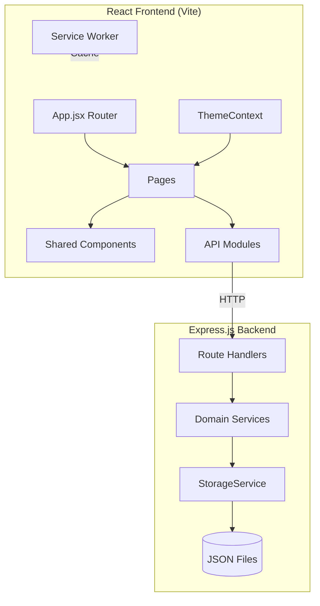

# Design Document: Sweepstake Enhancements

## Overview

This design covers nine enhancements to the existing World Cup Sweepstake application: Live Match Day View, Points History Timeline, Activity Feed, My Teams Dashboard, Group Stage Table, Share/Export Standings, Dark Mode, Mobile PWA Support, and Knockout Bracket View.

The existing application uses a React 19 + Vite frontend with React Router, and an Express.js backend with JSON file storage (using `proper-lockfile` for concurrency). The architecture follows a service-layer pattern on the backend (`storageService` → domain services → routes) and a page/component pattern on the frontend with API modules.

### Design Principles

- **Incremental enhancement**: Each feature is additive — no breaking changes to existing data models or APIs
- **Consistent patterns**: Follow existing service-layer architecture on the backend and page/component structure on the frontend
- **Minimal dependencies**: Prefer lightweight libraries; avoid heavy frameworks where vanilla solutions suffice
- **Offline-aware**: PWA support enables graceful degradation when offline
- **Accessibility**: WCAG AA compliance for colour contrast in both themes

## Architecture



### New Routes (Backend)

| Method | Path | Purpose |
|--------|------|---------|
| GET | `/api/fixtures/today` | Fixtures for current day |
| GET | `/api/fixtures/week` | Fixtures for current week |
| GET | `/api/leagues/:slug/points-history` | Points timeline data |
| GET | `/api/leagues/:slug/activity` | Activity feed events |
| GET | `/api/leagues/:slug/my-teams/:participantId` | My Teams dashboard data |
| GET | `/api/groups` | Group stage standings |
| GET | `/api/leagues/:slug/standings/export` | Text export of standings |

### New Pages (Frontend)

| Route | Component | Feature |
|-------|-----------|---------|
| `/league/:slug/match-day` | MatchDayView | Live Match Day View |
| `/league/:slug/points-history` | PointsTimeline | Points History Timeline |
| `/league/:slug/activity` | ActivityFeed | Activity Feed |
| `/league/:slug/my-teams/:participantId` | MyTeamsDashboard | My Teams Dashboard |
| `/league/:slug/groups` | GroupStageTable | Group Stage Table |
| `/league/:slug/bracket` | KnockoutBracketView | Knockout Bracket View |

## Components and Interfaces

### Backend Services

#### MatchDayService
```javascript
// server/services/matchDayService.js
export async function getFixturesForDate(date: string): Promise<Fixture[]>
export async function getFixturesForWeek(date: string): Promise<Fixture[]>
```

#### PointsHistoryService
```javascript
// server/services/pointsHistoryService.js
export async function getPointsHistory(leagueSlug: string): Promise<PointsHistoryEntry[]>
```

#### ActivityService
```javascript
// server/services/activityService.js
export async function getActivityFeed(leagueSlug: string, page: number, limit: number): Promise<ActivityPage>
```

#### GroupService
```javascript
// server/services/groupService.js
export async function getGroupStandings(): Promise<GroupStanding[]>
```

#### ExportService
```javascript
// server/services/exportService.js
export async function generateStandingsText(leagueSlug: string): Promise<string>
```

### Frontend Components

#### ThemeContext
A React context providing `{ theme, toggleTheme }` to all components. Reads from `localStorage` on mount, falls back to `prefers-color-scheme`, then defaults to light.

#### CountdownTimer
A reusable component that accepts a `kickoffTime` prop and displays a live countdown (HH:MM:SS) that updates every second. Transitions to "LIVE" when time reaches zero.

#### PointsChart
A line chart component using a lightweight charting library (Chart.js via `react-chartjs-2` or a custom SVG-based solution). Displays cumulative points per participant over match days.

#### KnockoutBracket
An SVG-based bracket renderer that draws connector lines between rounds. Horizontally scrollable on narrow viewports.

#### ShareExportButtons
Buttons for copy-to-clipboard (text) and download-as-PNG (using `html2canvas`).

#### OfflineBanner
An inline message component shown when the service worker detects no network connectivity.

### PWA Infrastructure

- `public/manifest.json` — Web app manifest with icons, theme colour, standalone display
- `public/sw.js` — Service worker with cache-first strategy for app shell, network-first for API data
- Registration in `main.jsx` with graceful fallback if registration fails

## Data Models

### Existing Models (unchanged)

```typescript
interface Fixture {
  id: string;           // "f001"
  homeTeam: string;     // team ID e.g. "eng"
  awayTeam: string;
  date: string;         // ISO 8601
  stage: string;        // "Group Stage" | "Round of 16" | etc.
  status: string;       // "scheduled"
}

interface Result {
  id: string;           // "r001"
  fixtureId: string;
  homeTeam: string;
  awayTeam: string;
  homeScore: number;
  awayScore: number;
  date: string;
  stage: string;
  penaltyShootout: { winner: string; homeGoals?: number; awayGoals?: number } | null;
}

interface League {
  slug: string;
  name: string;
  joinCode: string;
  participants: { id: string; name: string }[];
  draft: {
    status: string;
    allocations: Record<string, Record<string, string[]>>;
  };
}

interface Team {
  id: string;
  name: string;
  seedRank: number;
}
```

### New Derived Models (computed, not stored)

```typescript
interface PointsHistoryEntry {
  matchDay: string;         // ISO date (UTC) e.g. "2026-06-11"
  participants: {
    participantId: string;
    participantName: string;
    cumulativePoints: number;
    matchResults: {          // results on this day involving participant's teams
      teamId: string;
      teamName: string;
      opponentId: string;
      opponentName: string;
      score: string;         // "2-1"
      pointsEarned: number;
    }[];
  }[];
}

interface ActivityEvent {
  id: string;
  type: "match_result" | "team_eliminated";
  timestamp: string;         // ISO 8601
  data: MatchResultEvent | TeamEliminatedEvent;
}

interface MatchResultEvent {
  fixtureId: string;
  homeTeam: string;
  awayTeam: string;
  homeScore: number;
  awayScore: number;
  stage: string;
  homeOwner: string | null;  // participant name in this league
  awayOwner: string | null;
  homePoints: number;
  awayPoints: number;
}

interface TeamEliminatedEvent {
  teamId: string;
  teamName: string;
  owner: string;             // participant name
  stage: string;             // stage where eliminated
}

interface ActivityPage {
  events: ActivityEvent[];
  page: number;
  totalPages: number;
  totalEvents: number;
}

interface GroupStanding {
  group: string;             // "A" through "L"
  teams: GroupTeamEntry[];
}

interface GroupTeamEntry {
  teamId: string;
  teamName: string;
  played: number;
  won: number;
  drawn: number;
  lost: number;
  goalsFor: number;
  goalsAgainst: number;
  goalDifference: number;
  points: number;
}

interface MyTeamsData {
  totalPoints: number;
  teams: MyTeamEntry[];
}

interface MyTeamEntry {
  teamId: string;
  teamName: string;
  pot: number;
  points: number;
  wins: number;
  draws: number;
  losses: number;
  goalsScored: number;
  goalsConceded: number;
  form: ("W" | "D" | "L")[];  // last 5 results, most recent first
  upcomingFixtures: {
    opponentId: string;
    opponentName: string;
    date: string;
    stage: string;
  }[];
}
```

### Group Assignment Data

Groups are derived from the fixture data. The 2026 World Cup has 12 groups (A–L) of 4 teams each. Group assignments are determined by the fixture schedule — teams that play each other in the "Group Stage" are in the same group. The system will derive groups by analysing which teams share group-stage fixtures.

Alternatively, a static `groups.json` mapping can be added to `server/data/` for explicit group definitions:

```json
{
  "groups": [
    { "name": "A", "teams": ["mex", "rsa", "kor", "cze"] },
    { "name": "B", "teams": ["can", "bih", "qat", "sui"] },
    ...
  ]
}
```

This static approach is preferred for correctness since fixture-based derivation requires exactly 3 group-stage fixtures per team pair.


## Correctness Properties

*A property is a characteristic or behavior that should hold true across all valid executions of a system — essentially, a formal statement about what the system should do. Properties serve as the bridge between human-readable specifications and machine-verifiable correctness guarantees.*

### Property 1: Date range fixture filter

*For any* set of fixtures with various dates and *for any* reference date, filtering fixtures by a date range (single day or Monday–Sunday week) SHALL return only fixtures whose date falls within that range, and the returned fixtures SHALL be sorted by date ascending.

**Validates: Requirements 1.1, 1.2**

### Property 2: Countdown time calculation

*For any* kickoff time and *for any* current time before that kickoff, the countdown function SHALL return the correct difference in hours, minutes, and seconds. When current time is at or past kickoff time, the function SHALL return a "LIVE" or "completed" status.

**Validates: Requirements 1.3, 1.4**

### Property 3: Cumulative points history

*For any* set of match results and league allocations, the points history computation SHALL produce data points only for dates (UTC) on which at least one result involving a participant's team was recorded, and the cumulative points for each participant SHALL be monotonically non-decreasing across successive match days, with each day's cumulative total equalling the sum of all points earned on that day and all prior days.

**Validates: Requirements 2.1, 2.2**

### Property 4: Activity event generation targets correct leagues

*For any* match result or team elimination event and *for any* set of league allocations, the activity feed SHALL generate events for exactly those leagues that have at least one of the involved teams allocated to a participant, and SHALL NOT generate events for leagues with no involvement.

**Validates: Requirements 3.1, 3.3**

### Property 5: Activity feed ordering

*For any* set of activity events, the feed output SHALL be sorted by event timestamp in descending order (most recent first).

**Validates: Requirements 3.2**

### Property 6: Per-team stats calculation

*For any* team and *for any* set of match results involving that team, the computed stats SHALL satisfy: points = 3 × wins + 1 × draws + penalty_bonus, where penalty_bonus is 1 for each draw where the team won the penalty shootout; and wins + draws + losses = total matches played by that team; and goals_difference = goals_scored - goals_conceded.

**Validates: Requirements 4.2**

### Property 7: Form indicator computation

*For any* team and *for any* set of match results, the form indicator SHALL contain at most min(5, total_matches_played) entries, each being exactly one of "W", "D", or "L", ordered by match date descending (most recent first), where each entry correctly reflects the match outcome for that team.

**Validates: Requirements 4.4, 4.5**

### Property 8: Total points invariant

*For any* participant with allocated teams, the total points displayed in the My Teams Dashboard summary SHALL equal the sum of individual team points contributions across all their allocated teams.

**Validates: Requirements 4.6**

### Property 9: Group standings computation and sorting

*For any* group of 4 teams and *for any* set of group-stage results among those teams, the computed standings SHALL satisfy: played = wins + draws + losses; goal_difference = goals_for - goals_against; points = 3 × wins + draws; and teams SHALL be sorted by points descending, then goal difference descending, then goals scored descending.

**Validates: Requirements 5.2, 5.3**

### Property 10: Standings text export format

*For any* league with participants and standings data, the generated text export SHALL contain the league name, the current date in DD/MM/YYYY format, and one line per participant in rank order where each line contains the rank number, participant name, and total points.

**Validates: Requirements 6.1, 6.6**

### Property 11: Knockout bracket progression

*For any* set of knockout-stage results, the bracket SHALL correctly place the winner of each fixture into the next round's corresponding position, where the winner is the team with more goals or the penalty shootout winner when scores are equal. Positions without a determining result SHALL display "TBD".

**Validates: Requirements 9.2, 9.3**

## Error Handling

### Backend Errors

| Scenario | HTTP Status | Response |
|----------|-------------|----------|
| League not found | 404 | `{ "error": "League not found" }` |
| Participant not found in league | 404 | `{ "error": "Participant not found" }` |
| Invalid page number (< 1) | 400 | `{ "error": "Invalid page number" }` |
| JSON file corruption | 500 | `{ "error": "Internal server error" }` |
| File lock contention | 503 | `{ "error": "Service busy, please retry" }` |

### Frontend Error States

- **Network failure**: Display inline error message with retry button; do not crash the page
- **API 404**: Show "not found" state with navigation back to league view
- **API 500/503**: Show generic error with automatic retry after 5 seconds
- **Empty data states**: Each view has a specific empty-state message (defined in requirements)
- **Clipboard API unavailable**: Fallback to selectable textarea (Requirement 6.4)
- **Service worker registration failure**: App continues without offline support (Requirement 8.7)
- **Chart rendering failure**: Show tabular data fallback for points timeline

### Offline Handling (PWA)

- Service worker serves cached app shell when offline
- Each data-dependent page shows an inline "You're offline — live data unavailable" banner
- On reconnection, auto-fetch with up to 3 retries at 5-second intervals
- Cached navigation remains functional between pages

## Testing Strategy

### Property-Based Tests (fast-check)

The project already includes `fast-check` v4.1.1. Each correctness property above will be implemented as a property-based test with a minimum of 100 iterations.

**Test file locations:**
- `server/services/matchDayService.test.js` — Properties 1, 2
- `server/services/pointsHistoryService.test.js` — Properties 3, 8
- `server/services/activityService.test.js` — Properties 4, 5
- `server/services/myTeamsService.test.js` — Properties 6, 7
- `server/services/groupService.test.js` — Property 9
- `server/services/exportService.test.js` — Property 10
- `server/services/bracketService.test.js` — Property 11

**Configuration:**
- Each test runs minimum 100 iterations (`numRuns: 100`)
- Each test is tagged with a comment: `// Feature: sweepstake-enhancements, Property N: <description>`
- Generators produce realistic fixture/result data with valid team IDs, dates, and scores

### Unit Tests (Example-Based)

- Empty state rendering for each new page component
- Theme toggle persistence to localStorage
- Colour assignment uniqueness for ≤6 participants
- Pagination boundary conditions (page 1, last page, beyond range)
- Filename format for PNG export
- Penalty shootout display format
- Ownership lookup for team highlighting
- Service worker graceful degradation

### Integration Tests

- API endpoint responses for new routes (supertest)
- Polling mechanism for live match updates
- Clipboard API interaction (mocked)
- Image generation with html2canvas (mocked canvas)
- Service worker caching behaviour (mocked fetch)

### Manual Testing

- Visual bracket layout across viewport sizes
- Dark mode colour contrast verification (WCAG AA)
- PWA install flow on mobile devices
- Countdown timer accuracy over extended periods
- Chart interactivity (hover tooltips, legend clicks)
