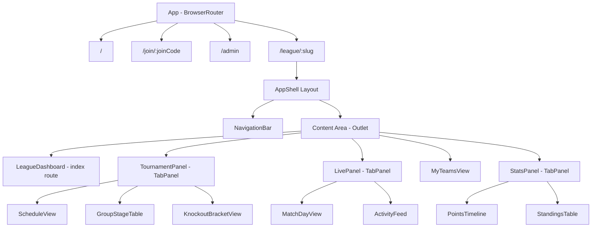
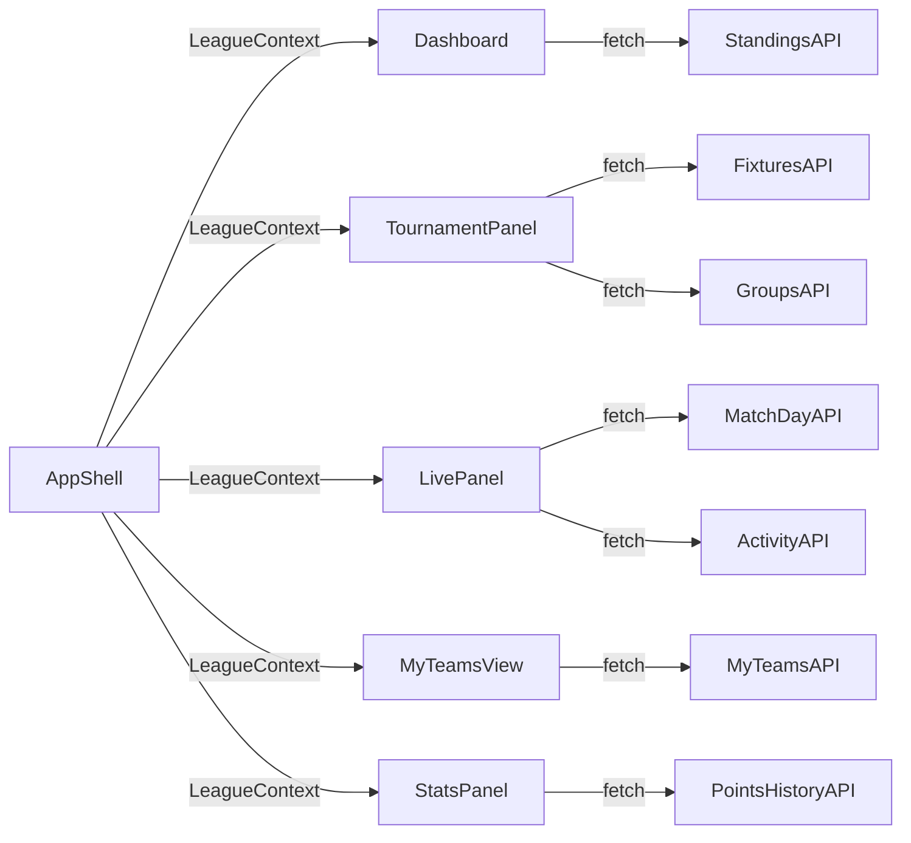

# Design Document: UI Modernization

## Overview

This design modernizes the World Cup Sweepstake app's frontend by introducing a persistent App Shell layout, responsive navigation, tabbed content panels, and an updated visual design system. The current architecture renders each league view as a standalone route with its own navigation links and data fetching. The new architecture wraps all league routes in a shared shell component using React Router's nested routes and `<Outlet>` pattern, consolidates related views into reusable `TabPanel` components, and upgrades the design token system for a polished, modern aesthetic.

The implementation uses only plain CSS with CSS custom properties (no component library), CSS-only animations with `prefers-reduced-motion` support, and the existing React + Vite + React Router stack.

## Architecture

### High-Level Component Tree



### Routing Structure

The app transitions from flat routes to nested routes under the App Shell:

```
/                           → HomePage (no shell)
/join/:joinCode             → JoinPage (no shell)
/admin                      → AdminPanel (no shell)
/league/:slug               → AppShell wrapper
  /league/:slug             → LeagueDashboard (index)
  /league/:slug/tournament  → TournamentPanel (TabPanel: Schedule | Groups | Bracket)
  /league/:slug/live        → LivePanel (TabPanel: MatchDay | Activity)
  /league/:slug/my-teams    → MyTeamsView (participant selector + dashboard)
  /league/:slug/stats       → StatsPanel (TabPanel: Points History | Standings)
  /league/:slug/draft       → DraftSession (within shell)
```

### Data Flow

The `AppShell` component fetches shared league data (league metadata, participants, draft status) once and provides it via React context to all child routes. Individual tab content components continue to fetch their own specific data (fixtures, results, activity events) but no longer need to independently fetch league metadata.



## Components and Interfaces

### AppShell

The persistent layout wrapper for all league routes.

```jsx
// src/components/shell/AppShell.jsx
interface AppShellProps {
  // No props - uses React Router's useParams and Outlet
}

// Renders:
// - League header (name + current section title)
// - NavigationBar
// - <Outlet /> for child route content
// - Provides LeagueContext to children
```

**Responsibilities:**
- Fetches league data once on mount (and on slug change)
- Provides `LeagueContext` with league, participants, draft status, teams
- Renders persistent NavigationBar and header
- Contains ThemeToggle within the header region
- Does not unmount between child route transitions

### NavigationBar

Responsive navigation component with overflow handling.

```jsx
// src/components/shell/NavigationBar.jsx
interface NavigationBarProps {
  leagueSlug: string;
  participants: Participant[];
}

interface NavigationItem {
  id: string;
  label: string;
  icon: string;       // emoji or SVG reference
  path: string;       // relative route path
  isPrimary: boolean; // true for first 4 items shown directly
}
```

**Behavior:**
- Desktop (>768px): Horizontal top bar with labeled icons
- Mobile (≤768px): Fixed bottom tab bar with icons + compact labels
- Shows first 4 items directly; remaining items in "More" overflow menu
- Overflow: popover on desktop, slide-up panel on mobile
- Active item highlighted with distinct background/border
- 44px minimum touch targets on mobile
- Overflow panel dismisses on outside tap or item selection

### TabPanel

Reusable tabbed container for consolidating related views.

```jsx
// src/components/shell/TabPanel.jsx
interface TabPanelProps {
  tabs: TabDefinition[];
  defaultTab?: string;        // defaults to first tab
  preserveScroll?: boolean;   // default true
  animationDirection?: 'horizontal' | 'none';
}

interface TabDefinition {
  id: string;
  label: string;
  content: React.ReactNode;   // lazy-rendered tab content
  errorFallback?: React.ReactNode;
}
```

**Behavior:**
- Renders tab controls and active tab content
- Switches content without route change (client-side state)
- Preserves scroll position per tab within session
- Animates content with horizontal slide (150ms) respecting `prefers-reduced-motion`
- On content load failure: shows error message, keeps tab controls interactive
- Active tab has distinct selected visual state

### Card

Reusable container with elevation variants.

```jsx
// src/components/ui/Card.jsx
interface CardProps {
  elevation?: 'flat' | 'raised' | 'prominent';
  hoverable?: boolean;    // enables hover lift effect
  padding?: 'default' | 'compact'; // responsive padding
  children: React.ReactNode;
  className?: string;
}
```

**Elevation levels:**
- `flat`: No box-shadow
- `raised`: `box-shadow: 0 4px 6px rgba(0,0,0,0.07)`
- `prominent`: `box-shadow: 0 10px 15px rgba(0,0,0,0.1)`

**Hover behavior (when `hoverable`):**
- translateY(-2px) + elevation bump to next level
- 200ms ease transition
- Respects `prefers-reduced-motion`

### LeagueDashboard

Refactored from the current `LeagueView` into a dashboard rendered within the shell.

```jsx
// src/pages/LeagueDashboard.jsx
// No props - uses LeagueContext from AppShell
```

**Renders:**
- Points summary widget (rank + total points) when draft is completed
- Standings table (prominent Card)
- Add participant section (flat Card, shown when < 6 participants)
- Draft actions (start/continue draft)
- Share/export buttons

### LeagueContext

React context providing shared league data to all shell children.

```jsx
// src/context/LeagueContext.jsx
interface LeagueContextValue {
  league: League | null;
  participants: Participant[];
  draftStatus: 'not_started' | 'in_progress' | 'completed';
  teams: Team[];
  results: Result[];
  loading: boolean;
  error: string | null;
  refetch: () => Promise<void>;
}
```

## Data Models

### Design Tokens (variables.css updates)

```css
:root {
  /* Typography - Inter font stack */
  --font-family: 'Inter', -apple-system, BlinkMacSystemFont, 'Segoe UI', 
    Roboto, Oxygen, Ubuntu, Cantarell, sans-serif;

  /* 8px grid spacing system */
  --space-1: 4px;    /* 0.5 unit */
  --space-2: 8px;    /* 1 unit */
  --space-3: 16px;   /* 2 units */
  --space-4: 24px;   /* 3 units */
  --space-5: 32px;   /* 4 units */
  --space-6: 48px;   /* 6 units */

  /* Card elevation tokens */
  --elevation-flat: none;
  --elevation-raised: 0 4px 6px rgba(0, 0, 0, 0.07);
  --elevation-prominent: 0 10px 15px rgba(0, 0, 0, 0.1);

  /* Card styling */
  --card-radius: 16px;
  --card-padding: 24px;
  --card-padding-compact: 16px;
  --card-backdrop-blur: 8px;

  /* Animation tokens */
  --duration-instant: 0ms;
  --duration-fast: 100ms;
  --duration-normal: 200ms;
  --duration-slow: 350ms;
  --ease-default: ease;
  --ease-in-out: ease-in-out;

  /* Navigation */
  --nav-height-desktop: 56px;
  --nav-height-mobile: 64px;
  --nav-item-min-size: 44px;

  /* Layout */
  --content-max-width: 1200px;
  --content-padding-desktop: 32px;
  --content-padding-tablet: 16px;
  --content-padding-mobile: 16px;
}
```

### Navigation Items Configuration

```js
// src/config/navigation.js
export const NAVIGATION_ITEMS = [
  { id: 'dashboard', label: 'Dashboard', icon: '🏠', path: '', isPrimary: true },
  { id: 'tournament', label: 'Tournament', icon: '🏆', path: 'tournament', isPrimary: true },
  { id: 'live', label: 'Live', icon: '⚽', path: 'live', isPrimary: true },
  { id: 'stats', label: 'Stats', icon: '📈', path: 'stats', isPrimary: true },
  { id: 'my-teams', label: 'My Teams', icon: '👤', path: 'my-teams', isPrimary: false },
  { id: 'draft', label: 'Draft', icon: '🎯', path: 'draft', isPrimary: false },
];
```

### Tab Configurations

```js
// Tournament tabs
export const TOURNAMENT_TABS = [
  { id: 'schedule', label: 'Schedule' },
  { id: 'groups', label: 'Groups' },
  { id: 'bracket', label: 'Bracket' },
];

// Live tabs
export const LIVE_TABS = [
  { id: 'match-day', label: 'Match Day' },
  { id: 'activity', label: 'Activity' },
];

// Stats tabs
export const STATS_TABS = [
  { id: 'points-history', label: 'Points History' },
  { id: 'standings', label: 'Standings' },
];
```

## Correctness Properties

*A property is a characteristic or behavior that should hold true across all valid executions of a system — essentially, a formal statement about what the system should do. Properties serve as the bridge between human-readable specifications and machine-verifiable correctness guarantees.*

### Property 1: Navigation item overflow partitioning

*For any* list of navigation items with length N > 5, the NavigationBar SHALL display exactly the first 4 items as primary visible items and place the remaining N-4 items in the overflow menu, preserving their original order.

**Validates: Requirements 2.3**

### Property 2: Tab switching displays correct content

*For any* TabPanel with N tabs (N ≥ 2) and any valid tab index i (0 ≤ i < N), switching to tab i SHALL render only the content associated with tab i and mark only tab i's control as active (with all other tab controls marked inactive).

**Validates: Requirements 3.4**

### Property 3: Tab scroll position round-trip

*For any* TabPanel tab that has been scrolled to position Y, switching to a different tab and then switching back SHALL restore the scroll position to Y (within 1px tolerance).

**Validates: Requirements 3.5**

### Property 4: Theme color contrast compliance

*For any* text color token paired with its designated background color token in the Theme_System (both light and dark modes), the computed contrast ratio SHALL be at least 4.5:1 for normal text sizes and at least 3:1 for large text sizes.

**Validates: Requirements 4.1**

### Property 5: Tab slide animation direction

*For any* TabPanel with ordered tabs and any transition from tab index `current` to tab index `target` (where current ≠ target), the content slide direction SHALL be left-to-right when target > current, and right-to-left when target < current.

**Validates: Requirements 7.2**

### Property 6: Reduced motion disables all timed transitions

*For any* animated element in the App_Shell, when the user's system has `prefers-reduced-motion: reduce` enabled, all CSS transition and animation durations SHALL resolve to 0ms, while non-animated visual feedback (color changes, opacity changes on hover/focus) SHALL remain functional.

**Validates: Requirements 7.5**

### Property 7: Animation duration ceiling

*For any* animation or transition defined in the design token system, the duration SHALL not exceed 300ms, ensuring no animation blocks pointer events, keyboard input, or content visibility beyond that threshold.

**Validates: Requirements 7.6**

## Error Handling

### Network Failures

| Scenario | Behavior |
|----------|----------|
| League data fetch fails in AppShell | Show error state with retry button; NavigationBar still renders with disabled items |
| Tab content fails to load | Show inline error message within the tab content area; tab controls remain interactive for switching to other tabs |
| Polling update fails | Silently ignore; retain last known data; retry on next polling cycle |
| League not found (404) | Redirect to home page with toast notification |

### State Edge Cases

| Scenario | Behavior |
|----------|----------|
| Draft not completed | Hide points summary widget; show draft CTA instead |
| No participants yet | Show add-participant section; hide standings and stats |
| Empty fixtures/results | Show contextual empty state message within the relevant tab |
| Navigation to invalid tab | Default to first tab in the panel |
| Overflow menu open + route change | Dismiss overflow menu immediately |

### Accessibility Error States

- All error messages are announced to screen readers via `role="alert"` or `aria-live="polite"`
- Focus is managed when error states appear (focus moves to error message or retry button)
- Loading states use `aria-busy="true"` on the content region

## Testing Strategy

### Unit Tests (Example-Based)

Unit tests cover specific rendering scenarios, component API contracts, and edge cases:

- **AppShell**: Renders nav + outlet at league routes; hides nav at non-league routes; displays league name and section title
- **NavigationBar**: Renders correct layout at desktop/mobile breakpoints; highlights active item; shows overflow menu with correct items
- **TabPanel**: Renders correct number of tabs; defaults to first tab; shows error fallback on content failure
- **Card**: Renders with correct elevation class; applies hover styles when hoverable; uses responsive padding
- **LeagueDashboard**: Shows standings when draft complete; shows add-participant when < 6 participants; hides points widget when draft incomplete
- **Theme**: Persists to localStorage; applies without flash on reload

### Property-Based Tests

Property-based tests verify universal invariants using `fast-check`:

- **Property 1**: Generate arrays of 6-20 navigation items; verify partitioning into primary (4) and overflow (rest)
- **Property 2**: Generate tab panel configs (2-10 tabs) and random tab indices; verify content/active state
- **Property 3**: Generate scroll positions and tab switch sequences; verify scroll restoration
- **Property 4**: Extract all color token pairs from CSS; compute contrast ratios; verify WCAG AA compliance
- **Property 5**: Generate tab counts and (current, target) index pairs; verify slide direction
- **Property 6**: Render with prefers-reduced-motion; verify all computed transition durations are 0ms
- **Property 7**: Parse all duration tokens; verify none exceed 300ms

**Configuration:**
- Library: `fast-check` (already compatible with the Vite + React test setup)
- Minimum 100 iterations per property test
- Each test tagged: `Feature: ui-modernization, Property {N}: {description}`

### Integration Tests

- Full navigation flow: navigate between all shell sections, verify shell persistence
- Tab panel interaction: switch tabs, verify content updates, verify scroll preservation
- Theme toggle: switch themes, verify all components update, verify localStorage persistence
- Responsive behavior: resize viewport, verify layout transitions
- Polling: mock API updates, verify dashboard reflects new data within polling cycle

### Visual Regression (Manual)

- Screenshot comparison at key breakpoints (375px, 768px, 1024px, 1440px)
- Light/dark mode comparison for all views
- Animation review with and without `prefers-reduced-motion`

