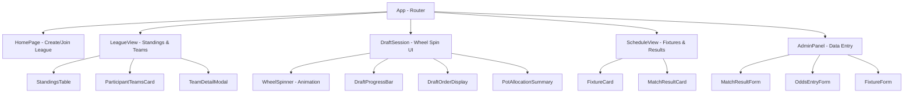

# Design Document: World Cup Sweepstake

## Overview

The World Cup Sweepstake is a full-stack JavaScript web application that enables groups of 6 people to form leagues, allocate FIFA World Cup teams via an animated snake draft, and track points throughout the tournament. The system uses a React frontend with Vite tooling, a Node.js/Express backend, and JSON file storage on disk.

Key design goals:
- **No authentication** — access is controlled via unique URLs (league view URLs and join links)
- **Server-side randomness** — the wheel spin animation is client-side, but team selection happens server-side to prevent manipulation
- **Shared global data** — teams, pots, fixtures, match results, and odds are shared across all leagues
- **Independent league state** — each league has its own participants, allocations, draft state, and points
- **Mobile-first responsive design** — all views work from 320px to 1920px viewports
- **Plain CSS styling** — no Tailwind, no component library; simple, functional stylesheets
- **Local deployment** — designed to run locally (no cloud hosting considerations)
- **Slug-based league URLs** — leagues are accessed via slugified names (e.g., `/league/office-legends`) for human-readable URLs

## Architecture

```mermaid
graph TB
    subgraph Client ["React Frontend (Vite)"]
        UI[React Components]
        WS[Wheel Spin Animation]
        API_CLIENT[API Client Layer]
    end

    subgraph Server ["Node.js / Express Backend"]
        ROUTES[Express Routes]
        MIDDLEWARE[Middleware - CORS, Validation, Admin Auth]
        SERVICES[Service Layer]
        STORAGE[JSON File Storage Layer]
    end

    subgraph Disk ["JSON File Storage"]
        TEAMS_FILE[teams.json]
        FIXTURES_FILE[fixtures.json]
        RESULTS_FILE[results.json]
        ODDS_FILE[odds.json]
        TOURNAMENT_FILE[tournament.json]
        LEAGUE_FILES[leagues/{slug}.json]
    end

    UI --> API_CLIENT
    API_CLIENT -->|HTTP REST| ROUTES
    ROUTES --> MIDDLEWARE
    MIDDLEWARE --> SERVICES
    SERVICES --> STORAGE
    STORAGE --> Disk
```

### Request Flow

1. Client makes HTTP request to Express API
2. Middleware handles CORS, request validation, and admin token verification (for admin routes)
3. Route handler delegates to appropriate service
4. Service performs business logic (draft selection, points calculation, validation)
5. Storage layer reads/writes JSON files with file-level locking to prevent corruption
6. Response returned to client

### Key Architectural Decisions

| Decision | Rationale |
|----------|-----------|
| JSON file storage | Simple deployment, no database setup, sufficient for ~100 leagues |
| Server-side random selection | Prevents client-side manipulation of draft picks |
| Client-side wheel animation | Smooth UX without server round-trip for animation frames |
| URL-based access (no auth) | Simplifies UX for casual groups; admin routes protected by env token |
| Shared global data files | Match results, odds, and fixtures are tournament-wide, not per-league |
| File-level locking on writes | Prevents race conditions when multiple leagues draft simultaneously |
| Slug-based league URLs | Human-readable URLs using slugified league names; uniqueness guaranteed by unique league name constraint |
| Plain CSS (no framework) | Keeps styling simple and dependency-free; no build complexity from Tailwind or component libraries |
| Auto-detect tournament completion | No manual button needed; system checks if all fixtures have results after each match entry |
| Local-only deployment | No cloud infrastructure concerns; runs on localhost for the tournament duration |

## Components and Interfaces

### Frontend Components

**Styling approach**: Plain CSS files (no Tailwind, no component library). Each component has a co-located `.css` file. CSS custom properties (variables) are used for theming consistency (colors, spacing, typography). Media queries handle responsive breakpoints.



### Backend API Endpoints

#### League Management

| Method | Path | Description |
|--------|------|-------------|
| POST | `/api/leagues` | Create a new league (slug derived from name) |
| GET | `/api/leagues/:slug` | Get league details (standings, teams, allocations) |
| POST | `/api/leagues/:slug/participants` | Add a participant to a league |
| GET | `/api/leagues/join/:joinCode` | Get league info via join link |
| POST | `/api/leagues/join/:joinCode` | Join a league via join link |

#### Draft

| Method | Path | Description |
|--------|------|-------------|
| POST | `/api/leagues/:slug/draft/start` | Initiate the snake draft (randomizes order) |
| GET | `/api/leagues/:slug/draft/state` | Get current draft state (order, progress, available teams) |
| POST | `/api/leagues/:slug/draft/spin` | Trigger a wheel spin (server selects team, returns result) |

#### Global Data (Shared)

| Method | Path | Description |
|--------|------|-------------|
| GET | `/api/teams` | Get all teams with pot assignments |
| GET | `/api/fixtures` | Get all fixtures |
| GET | `/api/results` | Get all match results |
| GET | `/api/odds/tournament` | Get tournament odds |
| GET | `/api/odds/match/:fixtureId` | Get match odds for a specific fixture |

#### Admin (Protected by token)

| Method | Path | Description |
|--------|------|-------------|
| POST | `/api/admin/results` | Enter a match result |
| PUT | `/api/admin/results/:id` | Update/correct a match result |
| POST | `/api/admin/odds/tournament` | Enter tournament odds snapshot |
| POST | `/api/admin/odds/match` | Enter match odds for a fixture |
| POST | `/api/admin/fixtures` | Add a fixture |
| PUT | `/api/admin/fixtures/:id` | Edit a fixture |

### Service Layer

```
services/
├── leagueService.js      — League CRUD, participant management, join links, slug generation
├── draftService.js       — Snake draft logic, random selection, state management
├── pointsService.js      — Points calculation, standings, tiebreakers
├── matchService.js       — Match result storage, validation, elimination tracking
├── oddsService.js        — Tournament and match odds management
├── fixtureService.js     — Fixture CRUD, schedule management
├── tournamentService.js  — Tournament completion auto-detection
└── storageService.js     — JSON file read/write with locking
```

### Storage Layer

The storage layer provides atomic read/write operations on JSON files with simple file-level locking using `proper-lockfile` (or equivalent) to prevent concurrent write corruption.

```javascript
// storageService interface
readFile(filename)          // Read and parse JSON file
writeFile(filename, data)   // Write data as JSON with lock
updateFile(filename, fn)    // Read, apply transform fn, write back (atomic)
```

## Data Models

### teams.json

```json
{
  "pots": [
    {
      "potNumber": 1,
      "teams": [
        { "id": "usa", "name": "United States", "seedRank": 1 },
        { "id": "ger", "name": "Germany", "seedRank": 2 }
      ]
    }
  ]
}
```

Each pot contains exactly 12 teams. Pot 1 = seed ranks 1–12, Pot 2 = 13–24, Pot 3 = 25–36, Pot 4 = 37–48.

### leagues/{slug}.json

```json
{
  "slug": "office-legends",
  "name": "Office Legends",
  "joinCode": "x7y8z9",
  "createdAt": "2025-06-01T10:00:00Z",
  "participants": [
    { "id": "p1", "name": "Alice" },
    { "id": "p2", "name": "Bob" }
  ],
  "draft": {
    "status": "not_started | in_progress | completed",
    "order": ["p3", "p1", "p6", "p2", "p5", "p4"],
    "currentPot": 4,
    "currentRound": 1,
    "currentPickIndex": 0,
    "spinsCompleted": 0,
    "allocations": {
      "p1": {
        "pot1": ["usa", "ger"],
        "pot2": ["mex", "jpn"],
        "pot3": ["crc", "nzl"],
        "pot4": ["ind", "chn"]
      }
    }
  }
}
```

**League identification:**
- `slug` — URL-friendly identifier derived from the league name (e.g., "Office Legends" → "office-legends"). Generated using simple slugification: lowercase, replace spaces/special chars with hyphens, collapse multiple hyphens, trim leading/trailing hyphens. Since league names are unique, slugs are guaranteed unique.
- League files are stored as `leagues/{slug}.json` and accessed via `/league/{slug}` on the frontend and `/api/leagues/{slug}` on the API.

**Draft state fields:**
- `status` — tracks whether draft is not started, in progress, or completed
- `order` — the randomized participant order (determined at draft start)
- `currentPot` — which pot is currently being drafted (4, 3, 2, 1)
- `currentRound` — round 1 (forward order) or round 2 (reverse order) within current pot
- `currentPickIndex` — position 0–5 within the current round
- `spinsCompleted` — total spins done (0–48)
- `allocations` — map of participant ID to their teams per pot

### fixtures.json

```json
{
  "fixtures": [
    {
      "id": "f001",
      "homeTeam": "usa",
      "awayTeam": "ger",
      "date": "2026-06-11T18:00:00Z",
      "stage": "Group Stage",
      "status": "scheduled | completed"
    }
  ]
}
```

Valid stages: `"Group Stage"`, `"Round of 16"`, `"Quarter-final"`, `"Semi-final"`, `"Third-place playoff"`, `"Final"`

### results.json

```json
{
  "results": [
    {
      "id": "r001",
      "fixtureId": "f001",
      "homeTeam": "usa",
      "awayTeam": "ger",
      "homeScore": 2,
      "awayScore": 1,
      "date": "2026-06-11T18:00:00Z",
      "stage": "Group Stage",
      "penaltyShootout": null
    },
    {
      "id": "r045",
      "fixtureId": "f045",
      "homeTeam": "bra",
      "awayTeam": "arg",
      "homeScore": 1,
      "awayScore": 1,
      "date": "2026-07-10T20:00:00Z",
      "stage": "Semi-final",
      "penaltyShootout": { "winner": "bra", "homeGoals": 4, "awayGoals": 2 }
    }
  ]
}
```

**Points derivation from a result:**
- If `homeScore > awayScore` → home team wins (3 pts), away team loses (0 pts)
- If `homeScore < awayScore` → away team wins (3 pts), home team loses (0 pts)
- If `homeScore === awayScore` → draw (1 pt each)
- If `penaltyShootout` is present → shootout winner gets +1 additional point (2 total)

**Elimination derivation:**
- A team is eliminated if it lost a knockout-stage match (stage is not "Group Stage")
- For penalty shootouts in knockout stages, the team that is NOT the `penaltyShootout.winner` is eliminated

### odds.json

```json
{
  "tournament": {
    "capturedAt": "2026-06-10T00:00:00Z",
    "odds": {
      "usa": 5.50,
      "ger": 7.00,
      "bra": 4.25
    }
  },
  "matches": {
    "f001": {
      "usa": 1.85,
      "ger": 3.40,
      "draw": 3.60
    }
  }
}
```

### Key Algorithms

#### Snake Draft Order

The draft processes pots in order: Pot 4 → Pot 3 → Pot 2 → Pot 1 (worst to best).

Within each pot, 2 rounds of 6 picks occur:
- Round 1: positions 1→6 (forward)
- Round 2: positions 6→1 (reverse)

```
Pot 4, Round 1: P1, P2, P3, P4, P5, P6  (picks 1–6)
Pot 4, Round 2: P6, P5, P4, P3, P2, P1  (picks 7–12)
Pot 3, Round 1: P1, P2, P3, P4, P5, P6  (picks 13–18)
Pot 3, Round 2: P6, P5, P4, P3, P2, P1  (picks 19–24)
Pot 2, Round 1: P1, P2, P3, P4, P5, P6  (picks 25–30)
Pot 2, Round 2: P6, P5, P4, P3, P2, P1  (picks 31–36)
Pot 1, Round 1: P1, P2, P3, P4, P5, P6  (picks 37–42)
Pot 1, Round 2: P6, P5, P4, P3, P2, P1  (picks 43–48)
```

Total: 48 spins, each participant ends with 8 teams (2 per pot).

#### Draft Pick Resolution (Server-Side)

```javascript
function selectTeam(leagueSlug) {
  const league = readLeague(leagueSlug);
  const { currentPot, allocations } = league.draft;
  
  // Get all teams in current pot
  const potTeams = getTeamsInPot(currentPot);
  
  // Get teams already allocated in this pot (across all participants in this league)
  const allocatedInPot = Object.values(allocations)
    .flatMap(a => a[`pot${currentPot}`] || []);
  
  // Available = pot teams minus already allocated
  const available = potTeams.filter(t => !allocatedInPot.includes(t.id));
  
  // Cryptographically random selection
  const selectedIndex = crypto.randomInt(0, available.length);
  const selectedTeam = available[selectedIndex];
  
  // Update draft state and return result
  return selectedTeam;
}
```

Uses `crypto.randomInt()` for unbiased random selection.

#### Points Calculation

```javascript
function calculatePoints(participantId, leagueSlug) {
  const league = readLeague(leagueSlug);
  const allocations = league.draft.allocations[participantId];
  const participantTeams = Object.values(allocations).flat();
  const results = readResults();
  
  let points = 0, wins = 0, draws = 0, losses = 0;
  let goalsScored = 0, goalsConceded = 0;
  
  for (const result of results) {
    for (const teamId of participantTeams) {
      if (result.homeTeam === teamId) {
        goalsScored += result.homeScore;
        goalsConceded += result.awayScore;
        if (result.homeScore > result.awayScore) { points += 3; wins++; }
        else if (result.homeScore === result.awayScore) {
          points += 1; draws++;
          if (result.penaltyShootout?.winner === teamId) { points += 1; }
        }
        else { losses++; }
      } else if (result.awayTeam === teamId) {
        goalsScored += result.awayScore;
        goalsConceded += result.homeScore;
        if (result.awayScore > result.homeScore) { points += 3; wins++; }
        else if (result.homeScore === result.awayScore) {
          points += 1; draws++;
          if (result.penaltyShootout?.winner === teamId) { points += 1; }
        }
        else { losses++; }
      }
    }
  }
  
  return { points, wins, draws, losses, goalsScored, goalsConceded, goalDifference: goalsScored - goalsConceded };
}
```

#### Tiebreaker Algorithm

```javascript
function rankParticipants(standings) {
  // Sort by: 1) points desc, 2) wins desc, 3) goal difference desc
  standings.sort((a, b) => {
    if (b.points !== a.points) return b.points - a.points;
    if (b.wins !== a.wins) return b.wins - a.wins;
    return b.goalDifference - a.goalDifference;
  });
  
  // Assign ranks (tied participants share a rank, next rank skips)
  let rank = 1;
  for (let i = 0; i < standings.length; i++) {
    if (i === 0) {
      standings[i].rank = rank;
    } else {
      const prev = standings[i - 1];
      const curr = standings[i];
      if (curr.points === prev.points && curr.wins === prev.wins && curr.goalDifference === prev.goalDifference) {
        curr.rank = prev.rank; // Same rank (tied)
      } else {
        curr.rank = i + 1; // Skip positions
      }
    }
  }
  return standings;
}
```

#### Elimination Detection

```javascript
function getEliminatedTeams(results) {
  const eliminated = new Set();
  const knockoutStages = ['Round of 16', 'Quarter-final', 'Semi-final', 'Third-place playoff'];
  
  for (const result of results) {
    if (!knockoutStages.includes(result.stage)) continue;
    
    if (result.penaltyShootout) {
      // Loser of shootout is eliminated
      const loser = result.penaltyShootout.winner === result.homeTeam 
        ? result.awayTeam : result.homeTeam;
      eliminated.add(loser);
    } else if (result.homeScore > result.awayScore) {
      eliminated.add(result.awayTeam);
    } else if (result.awayScore > result.homeScore) {
      eliminated.add(result.homeTeam);
    }
  }
  return eliminated;
}
```

Note: The Final match does not eliminate the loser (they finish 2nd). The Third-place playoff eliminates the loser (they finish 4th).

#### Tournament Completion Auto-Detection

The system automatically detects when the tournament is complete by checking if all fixtures have recorded results. This runs after every match result is saved.

```javascript
function checkTournamentComplete() {
  const fixtures = readFixtures();
  const results = readResults();
  
  // Build set of fixture IDs that have results
  const completedFixtureIds = new Set(results.map(r => r.fixtureId));
  
  // Tournament is complete when every fixture has a result
  const allComplete = fixtures.every(f => completedFixtureIds.has(f.id));
  
  if (allComplete && fixtures.length > 0) {
    markTournamentComplete();
  }
  
  return allComplete;
}

function markTournamentComplete() {
  updateFile('tournament.json', (data) => ({
    ...data,
    status: 'complete',
    completedAt: new Date().toISOString()
  }));
}
```

**Auto-detection trigger**: Called automatically within the match result save flow (in `matchService.js`) after every successful result entry or correction. No manual admin action required.

**Tournament state** is stored in `tournament.json`:

```json
{
  "status": "in_progress | complete",
  "completedAt": null
}
```

#### Slug Generation

```javascript
function slugify(name) {
  return name
    .toLowerCase()
    .trim()
    .replace(/[^a-z0-9\s-]/g, '')  // Remove special characters
    .replace(/[\s]+/g, '-')         // Replace spaces with hyphens
    .replace(/-+/g, '-')            // Collapse multiple hyphens
    .replace(/^-|-$/g, '');         // Trim leading/trailing hyphens
}
```

Since league names are required to be unique, the derived slug is guaranteed to be unique. The slug is generated at league creation time and stored as the league's primary identifier.


## Correctness Properties

*A property is a characteristic or behavior that should hold true across all valid executions of a system — essentially, a formal statement about what the system should do. Properties serve as the bridge between human-readable specifications and machine-verifiable correctness guarantees.*

### Property 1: Name validation

*For any* string, the name validation function SHALL accept it if and only if it has length between 1 and 50 characters (inclusive) and contains at least one non-whitespace character. This applies to both league names and participant names.

**Validates: Requirements 1.1, 1.4**

### Property 2: Duplicate league name rejection

*For any* valid league name, if a league with that name already exists in the system, then attempting to create another league with the same name (case-sensitive) SHALL be rejected.

**Validates: Requirements 1.2**

### Property 3: Duplicate participant name rejection

*For any* league and any valid participant name, if a participant with that name already exists in the league, then attempting to add another participant with the same name SHALL be rejected.

**Validates: Requirements 1.5**

### Property 4: Maximum participants constraint

*For any* league that already has 6 participants and any valid participant name, attempting to add a 7th participant SHALL be rejected and the league's participant list SHALL remain unchanged.

**Validates: Requirements 1.6**

### Property 5: Team-to-pot seed rank mapping

*For any* team with seed rank R in the system, the team SHALL be assigned to Pot ceil(R/12), such that ranks 1–12 map to Pot 1, ranks 13–24 to Pot 2, ranks 25–36 to Pot 3, and ranks 37–48 to Pot 4.

**Validates: Requirements 2.3**

### Property 6: Team uniqueness across pots

*For any* valid pot structure, no team ID SHALL appear in more than one pot, and all 48 team IDs SHALL be distinct.

**Validates: Requirements 2.4, 2.5**

### Property 7: Draft order is valid permutation

*For any* league with 6 participants, when the draft is initiated, the generated draft order SHALL be a permutation of all 6 participant IDs (each appears exactly once).

**Validates: Requirements 3.2**

### Property 8: Snake draft sequence correctness

*For any* completed draft, the 48 picks SHALL follow the snake pattern: within each pot, round 1 proceeds in forward order (positions 1→6) and round 2 proceeds in reverse order (positions 6→1), and pots are processed in order 4, 3, 2, 1.

**Validates: Requirements 3.3, 3.5, 3.6**

### Property 9: Draft allocates exactly 2 teams per pot per participant

*For any* completed draft, each participant SHALL have exactly 2 teams from each of the 4 pots, totalling exactly 8 teams per participant and 48 teams allocated overall.

**Validates: Requirements 3.4, 3.9**

### Property 10: Draft selection from available pool

*For any* draft spin, the selected team SHALL be a member of the set of teams in the current pot that have not yet been allocated to any participant in this league's draft.

**Validates: Requirements 3.8**

### Property 11: Tournament odds validation

*For any* tournament odds value submitted for a team, the system SHALL accept it if and only if it is a decimal number strictly greater than 1.0.

**Validates: Requirements 4.1**

### Property 12: Odds snapshot completeness

*For any* tournament odds snapshot, the system SHALL accept it if and only if it contains an odds value for every one of the 48 teams in the system. A snapshot missing any team SHALL be rejected.

**Validates: Requirements 4.2, 4.6**

### Property 13: Odds immutability (round-trip)

*For any* valid tournament odds snapshot, storing the snapshot and then reading it back SHALL return identical values for all 48 teams.

**Validates: Requirements 4.4**

### Property 14: Underdog labeling

*For any* match with two distinct odds values, the team with the higher decimal odds value SHALL be labeled as the underdog. If both odds are equal, neither team SHALL be labeled as underdog.

**Validates: Requirements 5.3, 5.4**

### Property 15: Match outcome determination

*For any* match result with scores (homeScore, awayScore), if homeScore > awayScore then the outcome SHALL be a win for the home team and a loss for the away team; if awayScore > homeScore then the outcome SHALL be a win for the away team and a loss for the home team; if homeScore === awayScore then the outcome SHALL be a draw for both teams.

**Validates: Requirements 6.3, 6.4**

### Property 16: Penalty shootout invariant

*For any* match result with a penalty shootout, the base scores (homeScore and awayScore) SHALL be equal, and the shootout winner SHALL be one of the two teams in the match.

**Validates: Requirements 6.5**

### Property 17: Team existence validation

*For any* match result submission, both teams referenced SHALL exist in the 48-team pool. If either team does not exist, the submission SHALL be rejected.

**Validates: Requirements 6.6, 17.4**

### Property 18: Score validation

*For any* match result submission, both homeScore and awayScore SHALL be non-negative integers. Negative values, non-integer values, or non-numeric values SHALL be rejected.

**Validates: Requirements 6.2**

### Property 19: Points calculation correctness

*For any* match result and participant who owns one of the teams in that match: a win SHALL award 3 points, a draw SHALL award 1 point, a loss SHALL award 0 points, and if the match has a penalty shootout the shootout winner's owner SHALL receive 1 additional point (2 total for that match).

**Validates: Requirements 7.1, 7.2, 7.3, 7.4**

### Property 20: Points additivity

*For any* participant in a league, the participant's total points SHALL equal the sum of points earned by each of their 8 allocated teams across all recorded match results.

**Validates: Requirements 7.5**

### Property 21: Ranking algorithm correctness

*For any* set of participant standings, the ranking SHALL sort by total points descending, then by number of wins descending as first tiebreaker, then by goal difference descending as second tiebreaker. Participants tied on all three criteria SHALL share the same rank, and the next rank SHALL skip by the number of tied positions.

**Validates: Requirements 8.1, 8.2, 8.3, 8.4**

### Property 22: League isolation

*For any* two distinct leagues, performing operations on one league (adding participants, running draft, calculating points) SHALL NOT modify the state of the other league.

**Validates: Requirements 9.2, 9.4**

### Property 23: Shared results propagation

*For any* match result entered into the system, all leagues containing the involved teams SHALL reflect the updated points for the participants who own those teams.

**Validates: Requirements 9.3**

### Property 24: Fixtures sorted by date

*For any* list of fixtures returned by the system, they SHALL be ordered by scheduled date and time in ascending order.

**Validates: Requirements 13.1**

### Property 25: Fixture ownership annotation

*For any* fixture viewed within a league context, each team in the fixture SHALL be annotated with the participant who owns that team (if the team is allocated in that league).

**Validates: Requirements 13.3, 13.4**

### Property 26: Completed fixture shows result

*For any* fixture that has a recorded match result, the system SHALL display the fixture as completed with the match result data rather than as a scheduled fixture.

**Validates: Requirements 13.5**

### Property 27: Knockout elimination

*For any* knockout-stage match result (Round of 16, Quarter-final, Semi-final, or Third-place playoff), the losing team SHALL be marked as eliminated. For penalty shootouts, the team that did NOT win the shootout SHALL be marked as eliminated.

**Validates: Requirements 14.1, 14.2**

### Property 28: Group stage never eliminates

*For any* group stage match result, regardless of the outcome (win, loss, or draw), no team SHALL be marked as eliminated.

**Validates: Requirements 14.6**

### Property 29: League slug and join code uniqueness

*For any* set of created leagues, all league slugs SHALL be unique and all join codes SHALL be unique. The slug SHALL be a deterministic transformation of the league name.

**Validates: Requirements 12.1, 12.2**

### Property 30: Tournament completion auto-detection

*For any* set of fixtures and results, the tournament SHALL be marked as complete if and only if every fixture in the system has a corresponding recorded result.

**Validates: Requirements 15.1**

## Error Handling

### Client-Side Errors

| Scenario | Handling |
|----------|----------|
| Network failure during API call | Display toast notification with retry option; preserve form state |
| Spin triggered during animation | Button disabled during animation; ignore duplicate clicks |
| Invalid league URL | Display "League not found" page with link to home |
| Invalid join link | Display "League not found" or "League full" message |
| Form validation failure | Inline error messages below fields; prevent submission |

### Server-Side Errors

| Scenario | HTTP Status | Response |
|----------|-------------|----------|
| League name already exists | 409 Conflict | `{ "error": "League name already taken" }` |
| League not found | 404 Not Found | `{ "error": "League not found" }` |
| League full (6 participants) | 400 Bad Request | `{ "error": "League already has maximum 6 participants" }` |
| Duplicate participant name | 409 Conflict | `{ "error": "Participant name already used in this league" }` |
| Draft already completed | 400 Bad Request | `{ "error": "Draft has already been completed" }` |
| Draft requires 6 participants | 400 Bad Request | `{ "error": "Exactly 6 participants required to start draft" }` |
| Invalid team in match result | 400 Bad Request | `{ "error": "Team not found in 48-team pool" }` |
| Invalid score (negative/non-integer) | 400 Bad Request | `{ "error": "Scores must be non-negative integers" }` |
| Incomplete odds snapshot | 400 Bad Request | `{ "error": "Odds must be provided for all 48 teams" }` |
| Invalid odds value (≤ 1.0) | 400 Bad Request | `{ "error": "Odds must be greater than 1.0" }` |
| Admin token missing/invalid | 401 Unauthorized | `{ "error": "Unauthorized" }` |
| File write conflict (lock timeout) | 503 Service Unavailable | `{ "error": "Service busy, please retry" }` |
| Malformed JSON body | 400 Bad Request | `{ "error": "Invalid request body" }` |

### File Storage Error Handling

- **Read failures**: Return 500 with generic error; log details server-side
- **Write lock contention**: Retry up to 3 times with exponential backoff (100ms, 200ms, 400ms); return 503 if all retries fail
- **Corrupt JSON file**: Log error, attempt to read backup (if available), return 500
- **Disk full**: Return 500 with "Storage unavailable" message; log alert

### Data Integrity

- All write operations use file-level locking to prevent concurrent modification
- Draft spins are atomic: selection + state update happen in a single locked write
- Points recalculation reads all results fresh (no cached/stale data)
- Admin result corrections trigger full recalculation for affected leagues

## Testing Strategy

### Unit Tests (Example-Based)

Unit tests cover specific scenarios, edge cases, and integration points:

- **Validation functions**: Test boundary values (empty string, 50 chars, 51 chars, whitespace-only)
- **Draft state machine**: Test transitions (not_started → in_progress → completed)
- **Points calculation**: Test specific match scenarios (win, loss, draw, penalty shootout)
- **Ranking**: Test specific tiebreaker scenarios
- **Elimination**: Test group stage vs knockout stage behavior
- **API endpoints**: Test request/response contracts with specific payloads
- **Error responses**: Test each error condition returns correct status and message

### Property-Based Tests

Property-based tests verify universal properties across randomly generated inputs. The project will use **fast-check** as the PBT library for JavaScript.

**Configuration:**
- Minimum 100 iterations per property test
- Each property test references its design document property
- Tag format: `Feature: world-cup-sweepstake, Property {number}: {title}`

**Properties to implement as PBT:**

1. **Name validation** (Property 1) — Generate random strings, verify accept/reject matches rules
2. **Duplicate rejection** (Properties 2, 3) — Generate names, verify idempotent rejection
3. **Max participants** (Property 4) — Generate participant lists, verify constraint
4. **Seed rank mapping** (Property 5) — Generate teams with ranks, verify pot assignment
5. **Team uniqueness** (Property 6) — Generate pot structures, verify no duplicates
6. **Draft order permutation** (Property 7) — Generate participant sets, verify permutation
7. **Snake draft sequence** (Property 8) — Simulate drafts, verify pick order
8. **Draft allocation counts** (Property 9) — Simulate drafts, verify 2-per-pot invariant
9. **Selection from available** (Property 10) — Simulate partial drafts, verify selection validity
10. **Odds validation** (Property 11) — Generate decimals, verify accept/reject
11. **Odds completeness** (Property 12) — Generate partial/complete snapshots, verify validation
12. **Odds round-trip** (Property 13) — Generate odds, store/read, verify equality
13. **Underdog labeling** (Property 14) — Generate odds pairs, verify labeling
14. **Outcome determination** (Property 15) — Generate score pairs, verify outcome
15. **Penalty shootout invariant** (Property 16) — Generate shootout results, verify constraints
16. **Team existence** (Property 17) — Generate team IDs (valid/invalid), verify validation
17. **Score validation** (Property 18) — Generate numbers, verify accept/reject
18. **Points calculation** (Property 19) — Generate results, verify point awards
19. **Points additivity** (Property 20) — Generate multi-match scenarios, verify sum
20. **Ranking algorithm** (Property 21) — Generate standings data, verify sort order and rank assignment
21. **League isolation** (Property 22) — Generate operations on two leagues, verify independence
22. **Knockout elimination** (Property 27) — Generate knockout results, verify elimination
23. **Group stage safety** (Property 28) — Generate group stage results, verify no elimination
24. **Slug uniqueness** (Property 29) — Generate multiple leagues, verify unique slugs and join codes
25. **Tournament completion** (Property 30) — Generate fixture/result sets, verify auto-detection logic

### Integration Tests

- **Full draft flow**: Create league → add 6 participants → run complete 48-spin draft → verify allocations
- **Points lifecycle**: Enter results → verify standings update → correct result → verify recalculation
- **Multi-league**: Create multiple leagues → enter shared results → verify independent standings
- **Admin flow**: Enter fixtures → enter odds → enter results → verify all data accessible
- **Join flow**: Create league → use join link → add participants → verify league state
- **Tournament completion**: Enter all fixture results → verify tournament auto-detected as complete → verify final standings locked
- **Slug-based access**: Create league with name → verify accessible via slugified URL

### End-to-End Tests

- **Happy path**: Create league → share join link → fill league → run draft → view standings
- **Mobile viewport**: Run key flows at 320px width
- **Error paths**: Invalid URLs, full leagues, duplicate names

### Test Tools

- **Test runner**: Vitest (aligns with Vite tooling)
- **PBT library**: fast-check
- **API testing**: supertest (for Express endpoint tests)
- **Component testing**: React Testing Library
- **E2E**: Playwright (optional, for critical paths)
